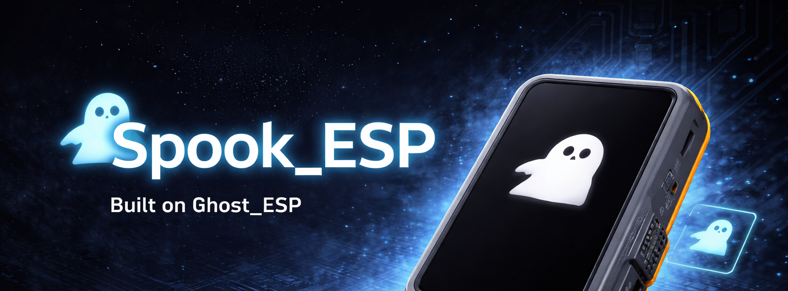

# Spook ESP
## A Tri-Band Security Radio Toolkit for the T-Display-P4



**Built on [Ghost_ESP](https://github.com/Spooks4576/Ghost_ESP) by [Spooks4576](https://github.com/Spooks4576)**
**Developed by [jstockdale](https://github.com/jstockdale) / [Off by One](https://offx1.com)**

A dual-chip security research platform built on the LilyGo T-Display-P4,
leveraging the ESP32-P4 as the UI/application processor and the ESP32-C6
as a tri-band radio subsystem (WiFi 6, BLE 5.3, Zigbee/Thread) running
a comprehensive security toolkit over a custom SDIO protocol.

---

## Table of Contents

1. [Architecture](#architecture)
2. [Hardware Wiring](#hardware-wiring)
3. [SDIO Protocol](#sdio-protocol)
4. [C6 Firmware](#c6-firmware)
5. [P4 Host Driver](#p4-host-driver)
6. [Building](#building)
7. [Bringup Guide](#bringup-guide)
8. [Command Reference](#command-reference)
9. [Portal System](#portal-system)
10. [SD Card Note](#sd-card-note)
11. [Known Issues](#known-issues)
12. [Credits](#credits)

---

## Architecture

```
┌──────────────────────────────────────────────────────────────┐
│  ESP32-P4 (400MHz dual-core RISC-V)                         │
│                                                              │
│  ┌─────────┐  ┌──────────┐  ┌─────────────────────────────┐ │
│  │ Display  │  │ ADS-B RX │  │ ghost_sdio_host component   │ │
│  │ (LVGL)   │  │ (RTL-SDR)│  │                             │ │
│  └─────────┘  └──────────┘  │  ghost_sdio_host_send_cmd() │ │
│                              │  ghost_sdio_host_recv()      │ │
│                              │  ghost_sdio_host_get_status()│ │
│                              └──────────┬──────────────────┘ │
│                                         │ SDMMC Slot 1       │
│  SD Card ← SPI (not SDMMC!)            │                    │
└─────────────────────────────────────────┼────────────────────┘
                                          │
            SD2 Bus: CLK, CMD, D0-D3      │  6 wires
            (P4 GPIO 15-20)               │
                                          │
┌─────────────────────────────────────────┼────────────────────┐
│  ESP32-C6-MINI-1-N4 (160MHz RISC-V)    │                    │
│                                     SDIO Slave               │
│  ┌──────────────────────────────────────┴──────────────────┐ │
│  │ SPOOK ESP — Security Radio Toolkit                      │ │
│  │                                                         │ │
│  │ WiFi 6 │ BLE 5.3 │ 802.15.4 │ 31 commands              │ │
│  │ Scan · Capture · Inject · Attack · Detect               │ │
│  └─────────────────────────────────────────────────────────┘ │
└──────────────────────────────────────────────────────────────┘
```

## Hardware Wiring

The T-Display-P4 board has the ESP32-C6-MINI-1-N4 connected to
the ESP32-P4 via a dedicated SDIO bus (SD2 in the schematic).
These connections are hardwired on the PCB.

### SDIO Bus (SD2)

| Signal     | P4 GPIO | C6 GPIO | C6 SDIO Function |
|------------|---------|---------|-------------------|
| SD2_D0     | 15      | 20      | SDIO_DATA0        |
| SD2_D1     | 16      | 21      | SDIO_DATA1        |
| SD2_D2     | 17      | 22      | SDIO_DATA2        |
| SD2_D3     | 18      | 23      | SDIO_DATA3        |
| SD2_CLK    | 19      | 19      | SDIO_CLK          |
| SD2_CMD    | 20      | 18      | SDIO_CMD          |

### C6 Control (via P4 GPIO expander XCL9535)

| Signal     | Purpose                   |
|------------|---------------------------|
| C6_ESP_EN  | Enable/reset the C6       |
| C6_WAKEUP  | Wake C6 from sleep        |

**No direct UART** between P4 and C6. SDIO is the only inter-chip data path.
C6 UART0 routes to the CNC1 debug connector for standalone use.

## SDIO Protocol

### Packet Framing

```
Offset  Size  Field    Description
──────  ────  ───────  ──────────────────────────────
0       1     magic    0x47 ('G') — frame sync
1       1     type     Frame type
2       2     seq      Sequence number (LE)
4       4     length   Payload byte count (LE)
8       0-4084 payload  Type-dependent data
```

### Frame Types

| Type | Value | Direction | Description                          |
|------|-------|-----------|--------------------------------------|
| CMD  | 0x01  | P4→C6     | Null-terminated command string       |
| RESPONSE | 0x02 | C6→P4  | Text output                          |
| STATUS | 0x03 | C6→P4    | Status change notification           |
| NETPIPE | 0x04 | Both    | TCP/UDP relay (future)               |
| PCAP | 0x05  | C6→P4     | Raw captured packet                  |
| GPS  | 0x06  | C6→P4     | NMEA sentence                        |
| HEARTBEAT | 0x07 | Both  | Keepalive                            |
| SCAN_RESULT | 0x08 | C6→P4 | Structured scan result (future)    |

### Shared Registers (CMD52, no FIFO)

| Reg | Dir    | Name        | Description                        |
|-----|--------|-------------|------------------------------------|
| 0   | C6→P4  | STATUS      | Current state                      |
| 1   | C6→P4  | RADIO_MODE  | Active radio                       |
| 2-3 | C6→P4  | ERROR       | 16-bit error code                  |
| 4   | P4→C6  | CONTROL     | Command (triggers C6 ISR)          |
| 5-6 | C6→P4  | FW_VERSION  | Major.Minor                        |
| 7   | C6→P4  | HEARTBEAT   | Increments each second             |

## C6 Firmware

### Directory Structure

```
ghost_esp_c6/
├── CMakeLists.txt
├── partitions.csv              4MB: NVS + app + SPIFFS
├── sdkconfig.defaults          esp32c6, WiFi+BLE+802.15.4
└── main/
    ├── main.c                  Entry point
    ├── Kconfig.projbuild       Build-time config
    ├── core/
    │   ├── sdio_transport.c    SDIO slave driver (610 lines)
    │   ├── commandline.c       31 commands + dispatch
    │   ├── callbacks.c         Promiscuous + BLE + PMKID callbacks
    │   ├── dns_server.c        Captive portal DNS hijack
    │   ├── system_manager.c    Task lifecycle
    │   └── utils.c             URL decode, hashing
    ├── managers/
    │   ├── wifi_manager.c      Scan, monitor, deauth, beacon, portal
    │   ├── ble_manager.c       NimBLE (6 scan modes)
    │   ├── ieee802154_manager.c Zigbee scan + injection
    │   ├── ap_manager.c        SoftAP
    │   ├── gps_manager.c       L76K GPS
    │   ├── settings_manager.c  NVS persistence
    │   └── sd_card_manager.c   SPI SD card
    └── vendor/
        ├── pcap.c              PCAP + CSV writers
        ├── printer.c           JetDirect
        ├── dial_client.c       SSDP/DIAL
        └── GPS/MicroNMEA.c     NMEA parser
```

## P4 Host Driver

### Installation

Copy `ghost_sdio_host/` into your P4 project's `components/` folder.

### Quick Start

```c
#include "ghost_sdio_host.h"

static void on_frame(ghost_frame_type_t type, const void *data, size_t len) {
    if (type == GHOST_FRAME_RESPONSE)
        printf("C6: %.*s", (int)len, (const char *)data);
}

void app_main(void) {
    ghost_sdio_host_config_t cfg = GHOST_SDIO_HOST_DEFAULT_CONFIG();
    cfg.frame_cb = on_frame;
    ghost_sdio_host_init(&cfg);

    ghost_sdio_host_send_cmd("scanap");
}
```

## Building

### C6 Firmware

```bash
cd ghost_esp_c6
idf.py set-target esp32c6
idf.py build
idf.py -p /dev/ttyUSB0 flash
```

Requires ESP-IDF v5.4.1+.

### P4 Integration

```bash
cp -r ghost_sdio_host your_p4_project/components/
cd your_p4_project && idf.py build
```

## Bringup Guide

1. **Flash C6, test standalone over UART** — `help`, `scanap`
2. **Add host component** — `ghost_sdio_host` in P4 `components/`
3. **Start with 1-bit SDIO at 20MHz** — verify card enumeration
4. **Send `help` from P4** — verify RESPONSE frames arrive
5. **Switch to 4-bit** — ramp frequency to 40MHz

### Troubleshooting

| Problem | Fix |
|---------|-----|
| `sdmmc_card_init failed` | C6 not powered or not running Spook firmware |
| `C6 not ready after 10000 ms` | Check C6 UART for boot errors |
| `no available sd host controller` | Use SPI for SD card, not SDMMC (#17889) |
| Corrupted data | Start at 400kHz, work up. Check pull-ups. |

## Command Reference

### WiFi Scanning & Recon
| Command | Description |
|---------|-------------|
| `scanap` | Scan WiFi access points |
| `scansta` | Scan WiFi stations |
| `stopscan` | Stop active scan |
| `list -a\|-s` | List APs or stations |
| `select -a <N>` | Select target AP |

### WiFi Attacks
| Command | Description |
|---------|-------------|
| `attack -d` | Deauth selected AP |
| `stopdeauth` | Stop deauth |
| `beaconspam -r\|-rr\|-l\|<SSID>` | Beacon spam |
| `stopspam` | Stop beacon spam |

### Packet Capture
| Command | Description |
|---------|-------------|
| `capture -probe` | Probe requests |
| `capture -beacon` | Beacons |
| `capture -deauth` | Deauth/disassoc |
| `capture -raw` | All 802.11 frames |
| `capture -eapol` | WPA handshakes |
| `capture -pmkid` | PMKID extraction (hashcat 22000) |
| `capture -pwn` | Pwnagotchi detection |
| `capture -wps` | WPS-enabled APs |
| `capture -ble` | BLE advertisements |
| `capture -skimmer` | BLE card skimmers |
| `capture -stop` | Stop all captures |
| `pmkid` | Show captured PMKIDs |
| `pmkid -c` | Clear PMKID results |

### BLE
| Command | Description |
|---------|-------------|
| `blescan -f` | Find Flipper Zero |
| `blescan -ds` | BLE spam detector |
| `blescan -a` | AirTag scanner |
| `blescan -r` | Raw BLE scan |
| `blescan -s` | Stop BLE |
| `blewardriving [-s]` | BLE wardriving with GPS |

### 802.15.4 (Zigbee/Thread)
| Command | Description |
|---------|-------------|
| `zigbee scan` | Scan channels 11-26 |
| `zigbee stop` | Stop scanning |
| `zigbee energy` | Energy detect per channel |
| `zigbee capture` | Raw frame capture to PCAP |
| `zigbee results` | Show discovered devices |
| `zigbee inject <ch> <hex>` | Inject raw frame |
| `zigbee beacon [ch]` | Send beacon request |
| `zigbee disassoc <pan> <addr> <ch> [reason]` | Disassociation |
| `zigbee replay <hex>` | Replay captured frame |

### Evil Portal
| Command | Description |
|---------|-------------|
| `portals` | List portal folders on SD card |
| `startportal <folder> <AP_SSID> <Domain>` | Offline portal from SD |
| `startportal <URL> <SSID> <Pass> <AP> <Domain>` | Online portal |
| `stopportal` | Stop portal |

### Network Tools
| Command | Description |
|---------|-------------|
| `connect <SSID> <password>` | Connect to WiFi |
| `scanlocal` | Show IP info |
| `scanports <IP> -C\|-A\|start-end` | Port scan |
| `pineap [-s]` | PineAP / rogue AP detection |
| `tplink on\|off\|loop` | TP-Link smart plug |
| `dialconnect` | DIAL smart TV cast |
| `printer <IP> <text> <size> <align>` | Network printer |

### GPS & Wardriving
| Command | Description |
|---------|-------------|
| `wardrive [-s]` | WiFi wardriving |
| `gpsinfo` | GPS fix data |

### System
| Command | Description |
|---------|-------------|
| `help` | Show all commands |
| `apcred <ssid> <pass>\|-r` | AP credentials |
| `stop` | Stop all operations |
| `reboot` | Reboot C6 |

## Portal System

Spook serves captive portals from folders on the SD card:

```
/sdcard/portals/
├── google/
│   ├── index.html       ← main page (required)
│   ├── style.css        ← served as /style.css
│   ├── logo.png         ← served as /logo.png
│   └── post.html        ← shown after credential capture
├── starbucks/
│   ├── index.html
│   ├── main.css
│   └── bg.jpg
```

**Usage:** `startportal google FreeWiFi login.portal`

The HTTP server maps URI paths directly to files in the folder.
Content types are detected from extension (HTML, CSS, JS, PNG,
JPG, GIF, SVG, ICO, WOFF/WOFF2/TTF, JSON). Directory traversal
is blocked. Captured credentials are logged to output AND saved
to `/sdcard/portal_creds.txt`.

If no folder is specified (or no SD card), a polished built-in
credential capture page is served as fallback.

Use `portals` command to list available folders and verify
each has an `index.html`.

## SD Card Note

On the T-Display-P4, access the TF card via **SPI**, not SDMMC.
The P4's SDMMC controller has a DMA state sharing bug between
slots (espressif/esp-idf#17889) that corrupts heap when both
SDMMC slots are active. SDMMC Slot 1 is reserved for the C6
SDIO link. SPI for the SD card avoids both issues.

## Known Issues

1. **Single radio constraint** — WiFi scanning and BLE scanning
   share coexistence. Running both reduces capture rates.

2. **802.15.4 + WiFi** — Switching between them requires
   stopping one first. The `stop` command handles this.

3. **Network pipe (NETPIPE)** — Frame type defined, relay
   implementation pending.

4. **SDIO throughput during promiscuous mode** — For high-volume
   PCAP, prefer writing to C6's local SD over streaming every
   packet across SDIO.

## Credits

**Spook ESP** is built on the foundation of
[Ghost_ESP](https://github.com/Spooks4576/Ghost_ESP) by
[Spooks4576](https://github.com/Spooks4576) and contributors.
Ghost_ESP provided the WiFi attack primitives, BLE scanning
architecture, command system design, and promiscuous mode
callback patterns that Spook extends.

**New in Spook:**
- SDIO slave/host transport (P4 ↔ C6 custom protocol)
- IEEE 802.15.4 scanning, energy detection, frame injection
- PMKID extraction with hashcat-ready output
- Folder-based evil portal with full asset serving
- P4 host driver component (ESSL over SDMMC)
- Shared register interface for out-of-band status

**Developed by** [John Stockdale](https://github.com/jstockdale) /
[Off by One](https://offx1.com)

## License

Based on Ghost_ESP (MIT). SDIO transport, 802.15.4 module, PMKID
capture, portal system, and P4 host driver are original work.
